## BUG #01 — Firebase: auth/invalid-api-key

### O que estava acontecendo
A inicialização do Firebase falhava com `auth/invalid-api-key` e o app não carregava.

### Por que acontecia
As variáveis de ambiente públicas do Next (`NEXT_PUBLIC_FIREBASE_*`) não estavam definidas, logo `apiKey` era `undefined` ao chamar `initializeApp`.

### Como corrigi
Antes: `initializeApp(firebaseConfig)` com `firebaseConfig.apiKey === undefined`

Depois: validei a presença de `NEXT_PUBLIC_FIREBASE_API_KEY` e instruí a criação de `.env.local` (veja `.env.example`).

**Status:** Corrigido (mensagem e validação adicionadas) — commit fb1153d

### Screenshot ou resultado
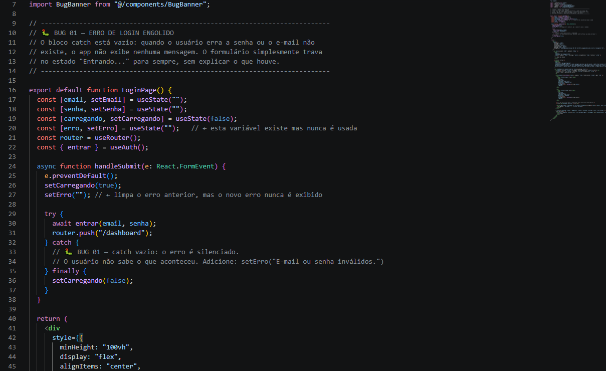
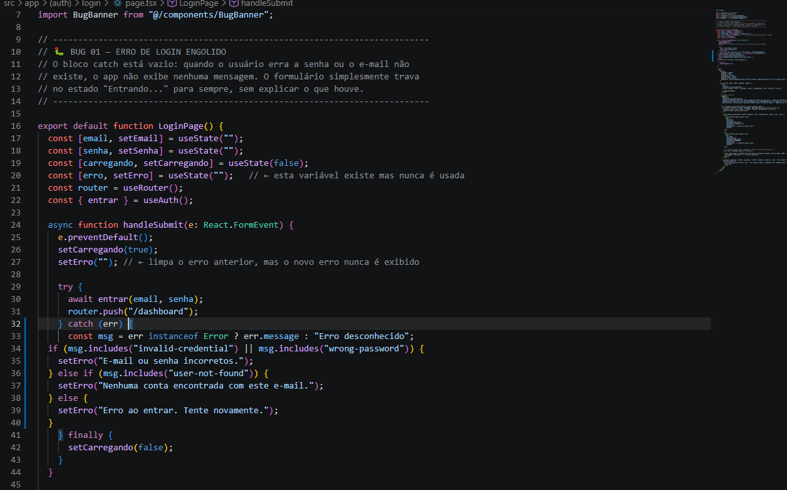

---

## BUG #02 — Middleware invertido (proteção de rotas)

### O que estava acontecendo
Usuários não autenticados conseguiam acessar rotas protegidas; usuários autenticados eram às vezes redirecionados ao login.

### Por que acontecia
A condição que verifica o token estava invertida: `if (token) redirect('/login')` ao invés de `if (!token) redirect('/login')`.

### Como corrigi
Antes: `if (token) return NextResponse.redirect(new URL('/login', request.url));`

Depois: `if (!token) return NextResponse.redirect(new URL('/login', request.url));`

**Status:** Corrigido — commit fb1153d

### Screenshot ou resultado
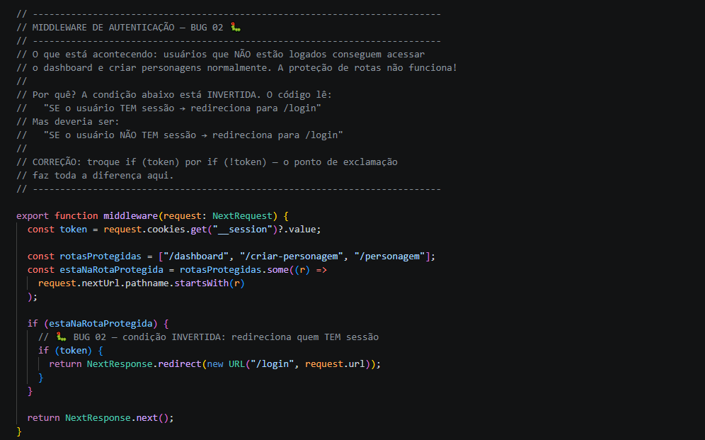
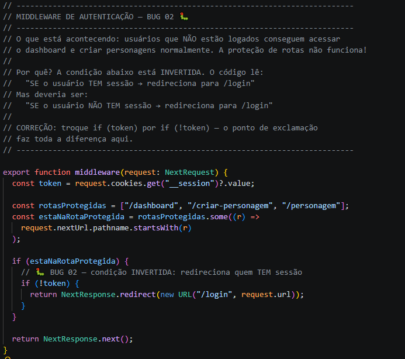

---

## BUG #03 — Confirmação de senha comparava variável errada

### O que estava acontecendo
O campo "Confirmar Senha" era ignorado e qualquer valor permitia o cadastro.

### Por que acontecia
O código comparava `senha` com `nome` em vez de `confirmarSenha` no formulário de cadastro.

### Como corrigi
Antes: `if (senha !== nome) { setErro(...) }`

Depois: `if (senha !== confirmarSenha) { setErro(...) }`

**Status:** Corrigido — commit fb1153d

### Screenshot ou resultado
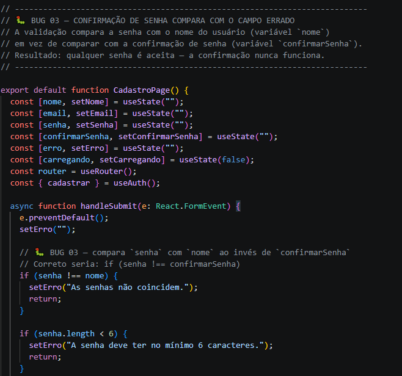
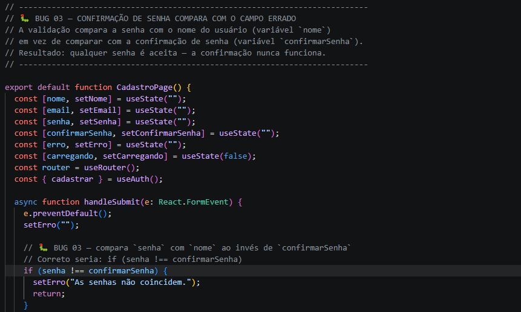

---

## BUG #04 — Listar personagens sem filtrar por usuário

### O que estava acontecendo
O dashboard mostrava personagens de todos os usuários, não apenas os do usuário logado.

### Por que acontecia
A query usada em `listarPersonagens` não aplicava `where('userId', '==', uid')`, retornando todos os documentos.

### Como corrigi
Antes: `const q = query(collection(db, 'personagens'))`

Depois: `const q = query(collection(db, 'personagens'), where('userId', '==', uid))` (importar `where`).

**Status:** Corrigido — commit fb1153d

### Screenshot ou resultado
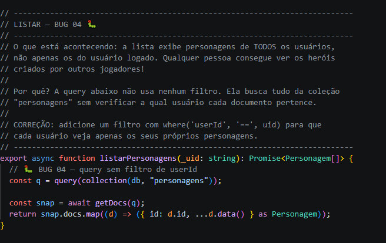
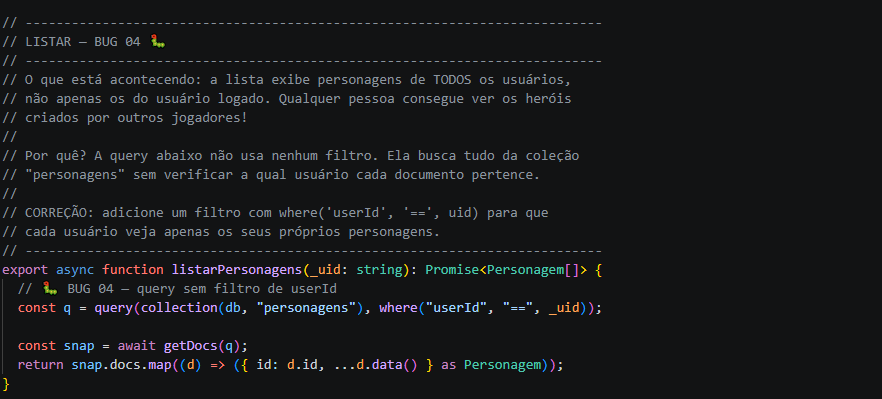

---

## BUG #05 — Criar personagem salva na coleção errada

### O que estava acontecendo
Personagens criados não apareciam no dashboard apesar do sucesso no formulário.

### Por que acontecia
O `addDoc` gravava em `collection(db, 'personagem')` (singular), enquanto o restante do app lê `personagens` (plural).

### Como corrigi
Antes: `addDoc(collection(db, 'personagem'), {...})`

Depois: `addDoc(collection(db, 'personagens'), {...})`

**Status:** Corrigido — commit fb1153d

### Screenshot ou resultado
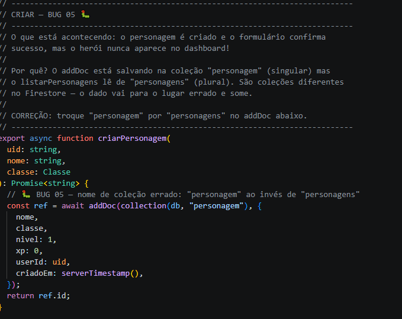
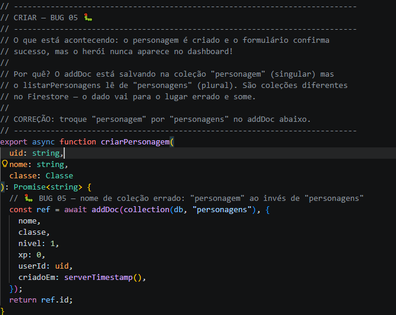

---

## BUG #06 — Equipar item apaga outros campos (uso de setDoc)

### O que estava acontecendo
Ao equipar um item, os demais campos do personagem (nome, classe, outros equipamentos) eram apagados.

### Por que acontecia
A função `equiparItem` usava `setDoc`, que substitui todo o documento, em vez de `updateDoc` que altera somente campos fornecidos.

### Como corrigi
Antes: `await setDoc(doc(db, 'personagens', personagemId), { [slot]: itemId })`

Depois: `await updateDoc(doc(db, 'personagens', personagemId), { [slot]: itemId })`

**Status:** Corrigido — commit fb1153d

### Screenshot ou resultado
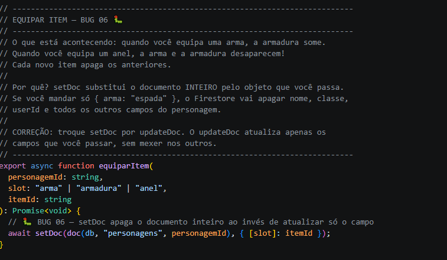
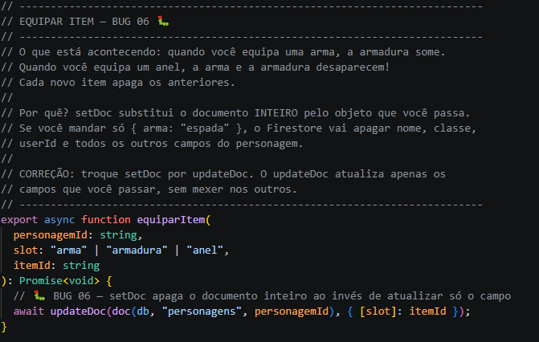

---

## BUG #07 — Deletar personagem usa índice ao invés de ID

### O que estava acontecendo
Ao deletar, o app removia o personagem errado ou retornava erro de documento inexistente.

### Por que acontecia
A função `deletarPersonagem` usava `String(indice)` como ID no `deleteDoc` em vez de `personagem.id`.

### Como corrigi
Antes: `await deleteDoc(doc(db, 'personagens', String(indice)))`

Depois: `await deleteDoc(doc(db, 'personagens', personagem.id))`

**Status:** Corrigido — commit fb1153d

### Screenshot ou resultado
![BUG07 - Antes] (public/screenshots/bug07-before.png)
![BUG07 - Depois] (public/screenshots/bug07-after.png)

---

## BUG #08 — Erro de login engolido (catch vazio)

### O que estava acontecendo
Ao fornecer credenciais inválidas, o botão ficava em "Entrando..." e nenhuma mensagem de erro era exibida.

### Por que acontecia
O bloco `catch` estava vazio, então erros do Firebase eram silenciosamente ignorados e `erro` nunca era preenchido.

### Como corrigi
Antes: `catch { /* vazio */ }`

Depois: `catch { setErro('E-mail ou senha inválidos.') }`

**Status:** Corrigido — commit fb1153d

### Screenshot ou resultado
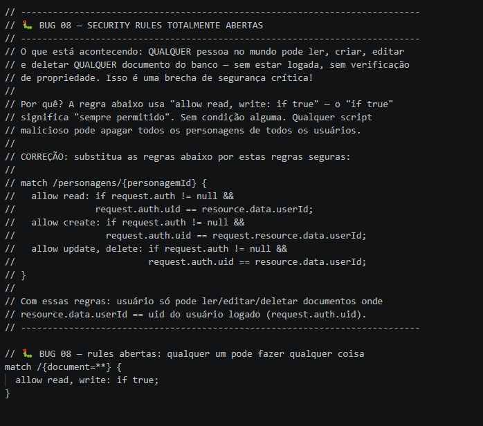
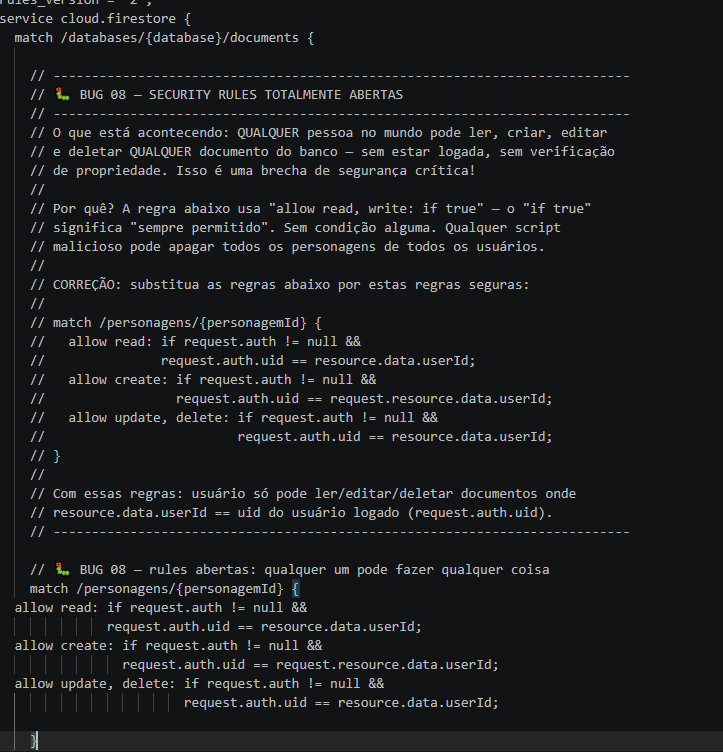